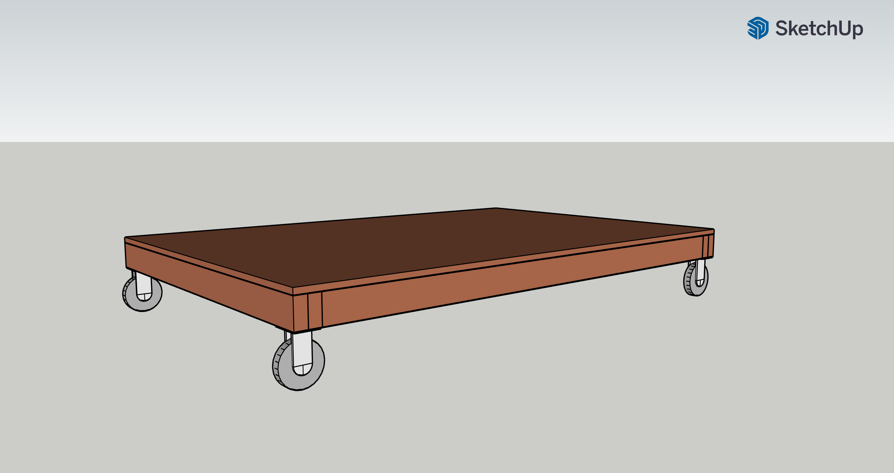
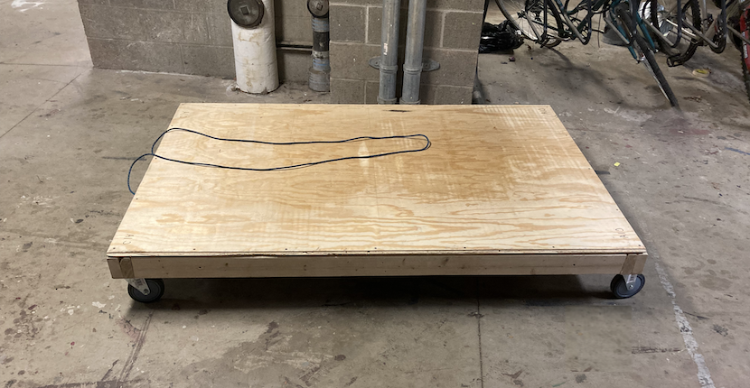
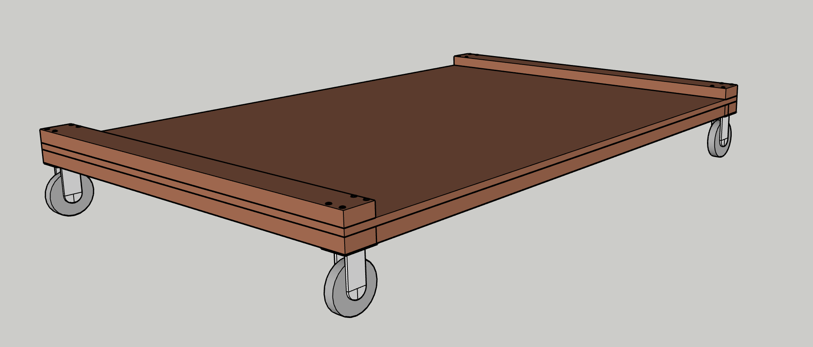
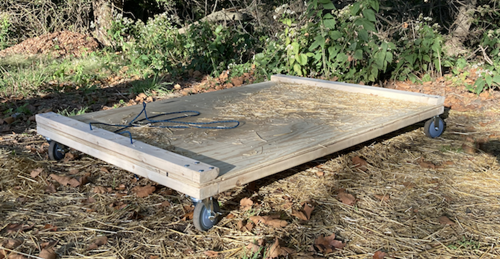
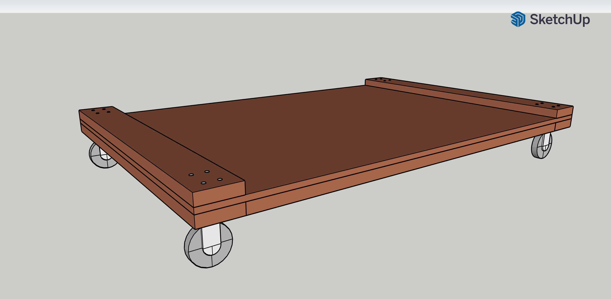
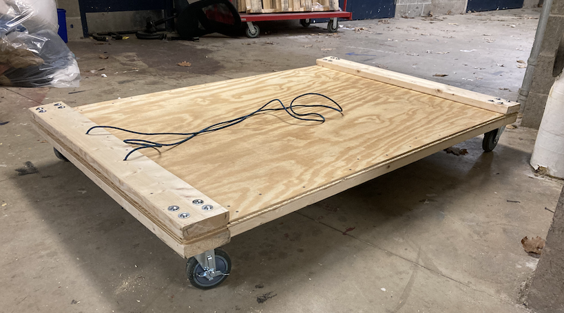

# CMU-Buggy-Bales-Cart

## Project Description

CMU Buggy is a multidisciplinary sport unique to Carnegie Mellon University (https://www.cmu.edu/buggy/). Completely
student-led, teams engineer, build, and race aerodynamic human-powered carts ("buggies") on a 0.84 mile course. Drivers
can reach speeds of up to 40 MPH, so safety is paramount.

For practices and races, up to one hundred 50-pound hay bales are installed along the course to serve as an impact barrier in
the event of a crash. It takes significant time and effort to install and remove these bales every weekend, so teams use
carts to ferry multiple bales around at once.

Store-bought carts have proven ineffective at withstanding the harsh conditions of weather, the weight of the bales, and
being handled by undergraduate students. Broken within days of first use, carts are constantly being replaced or done
without. Of my own initiative, I recognized the inefficiency of the current system of bales carts. I designed and
constructed a bales cart out of construction-grade lumber, and I improved the design multiple times to accommodate the
results of field testing. The custom cart has significantly reduced the amount of time and effort required to install
and remove hay bales for practices. Additionally, the design is modular, so components can be replaced as needed, rather
than the entire cart. Given the success of the first completed cart, I applied for and was granted funding for a second bales cart.

## Requirements

- Cart must be able to support multiple hay bales
- Cart will be stored outside and must be able to resist rain and sun and undergraduates

## Iteration 1

### Design:

Component|Description
---|---
Deck|(1) 23/32 in. x 4 ft. x 8 ft. Southern Pine Tongue and Groove Plywood Sheathing
Front/Rear Beams|(2) vertical 2x4 stacked side by side
Side Beams|(1) vertical 2x4 per side
Front Wheels|(2) 5 in. Medium Duty Gray TPR Swivel Plate Caster with Brake (350 lbs. Weight Capacity)
Rear Wheels|(2) 5 in. Medium Duty Gray TPR Swivel Plate Caster (350 lbs. Weight Capacity)
Hardware|\# 8 x 2 in. Phillips Bugle-Head Coarse Thread Sharp Point Polymer Coated Exterior Screws
Hardware|Zinc Flat Washers to support the screws used to attach the caster mounting plates to the beams
Hardware|Rope to use as a handle

### Notes:

- Contrary to the model, the orthogonal middle beam was not installed on the underside. It was determined that the deck
  would be strong enough without the middle beam, and removing the middle beam reduced the weight of the overall cart.
- Rope length works well for pulling

### Failures:

- Due to the width of the beams, the orientation of the casters could not accommodate fixed wheel casters. Using swivel
  casters for both front and rear wheel systems resulted in a cart that was more difficult to steer.
- Beams were attached to the deck using a small number of screws. The first use of the cart resulted in the rear beam
  being torn off the deck. It's possible that using additional screws could have prevented this failure, but a bolt
  mounting system would be an improvement.

## Iteration 2

### Design (changes only):

Component|Description
---|---
Front/Rear Beams|(2) horizontal 2x4 sandwiching the deck in both the front and rear
Side Beams|(1) horizontal 2x4 per side to serve as side beams for extra support
Hardware|5/16 in.-18 x 4-1/2 in. A307 Garde-A Zinc Plated Steel Carriage Bolts to anchor wheels to the front and rear beams
Hardware|5/16 in. Zinc Flat Washers
Hardware|5/16 in. Serrated Zinc Lock Nuts

### Notes:

- Carriage bolts on the front wheels were cut to allow the front wheels to rotate 360 degrees. Carriage bolts on the
  rear wheels were left long in order to restrict rear wheel rotation to a small arc.
- In addition to creating a stronger structure, having the beams stick above the deck of the cart helps keep the bales from falling off. 

### Failures:

- Cart has sustained multiple practices, but is already showing signs of wear. Horizontal beams are starting to pull
  apart at one end, indicating more hardware is needed to transfer forces to the deck in this area. One of the lock nuts on one wheel is coming loose, indicating that friction lock nuts are not enough
  to resist loosening due to rattling.
- Plywood is looking weathered.
- Although the carriage bolts in the rear helped restrict rotation of the rear wheels and improve steering, the small
  arc the rear wheels are allowed to rotate still makes it difficult to steer the cart.
- Carriage bolts are sinking into the soft wood beams at the top due to the lack of washers. If they continue to be
  tightened, it is likely they would split the beam.

## Iteration 3

### Design (changes only):

Component|Description
---|---
Front/Rear Beams|(2) horizontal 2x6 sandwiching the deck in both the front and rear. This allows for the rotation of the wheel mounting plates by 90 degrees so fixed wheel casters can be installed for the rear wheels.
Hardware|5/16 in.-18 Zinc Plated Nylon Lock Nuts. Selected to reduce loosening due to rattling.
Hardware|9/16 in. Zinc Flat Washers. These were chosen to support the top of the carriage bolts and prevent the bolts from sinking into the soft wood beams.
Coating|Varathane 1 qt. Clear Gloss Oil-Based Exterior Spar Urethane. Chosen to reduce weathering of the cart.

### Notes:

- One challenge I ran into was finding a way to tighten the lock nuts on the carriage bolts without having a means of keeping the bolts from rotating. My solution was to use a hammer to flatten small areas on opposing sides of the carriage bolt heads so an adjustable wrench could keep the bolt from rotating.

### Failures:

- TBD
